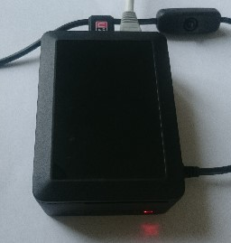
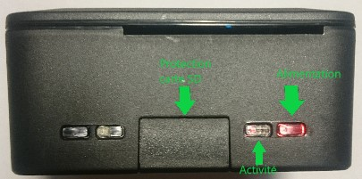

### Présentation du boîtier et branchements
Racebox se présente sous la forme d'un boîtier rectangulaire de 10 x 7,5 x 6,5 cm.

La face avant présente :
 - un témoin d'alimentation rouge, allumé si le boîtier est alimenté
 - un témoin d'activité verte qui clignote lorsque la Racebox fonctionne
 - un capot de protection optionnel pour la carte Micro-SD de la Racebox (une fois le capot enclenché, il est nécessaire d'ouvrir la Racebox pour le retirer).

L'alimentation se branche dans le port micro USB (indiqué par une flèche verte), sur la face droite du boîtier.

La face arrière présente un port Ethernet et 4 ports USB, dont un est occupé par un Dongle Wifi (qui sert à se connecter à un réseau relié à Internet).

Pour le moment, il est déconseillé d'utiliser un autre port que le port micro-USB pour l'alimentation et le port Ethernet pour la mise en réseau.
