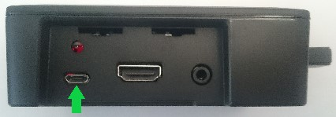
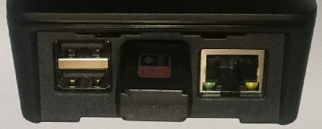

### Présentation du boîtier et branchements
L'alimentation se branche dans le port micro USB (indiqué par une flèche verte), sur la face droite du boîtier.

La face arrière présente un port Ethernet et 4 ports USB, dont un est prix par un Dongle Wifi.

