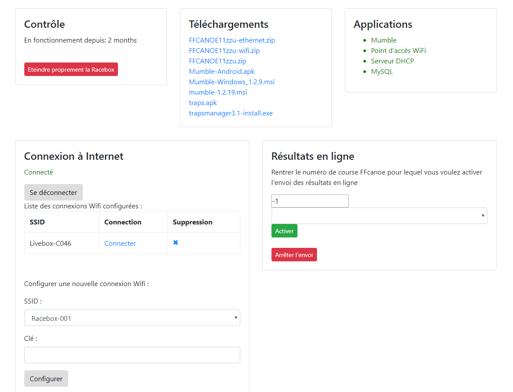

### Interface
L'interface de la Racebox est accessible par un navigateur.
Pour un terminal connecté au Wifi, il suffit d'accéder à [http://192.168.20.1](http://192.168.20.1).
Pour un ordinateur connecté via un switch, il faut utiliser [http://192.168.25.1](http://192.168.25.1)

- Le panneau "Contrôle" indique depuis combien de temps la Racebox fonctionne, et permet d'éteindre proprement le système une fois son utilisation terminée.
- Le panneau "Téléchargements" liste les fichiers disponibles, notamment la version pré-configurée de FFCanoe.
- Dans "Applications", on retrouve l'état des processus critiques qui tournent sur Racebox, notamment le point d'accès Wifi, le serveur DHCP qui attribue les adresses IP, la base de donnée MySQL qui enregistre les informations de FFCanoe et Mumble (le serveur de VOIP). Un processus en rouge signale un problème avec ce processus.
- L'onglet "Connexion à Internet" permet de configurer et de gérer la connection à Internet de la Racebox via Wifi.

L'interface s'enrichira avec de nouvelles fonctionnalités prochainement.
