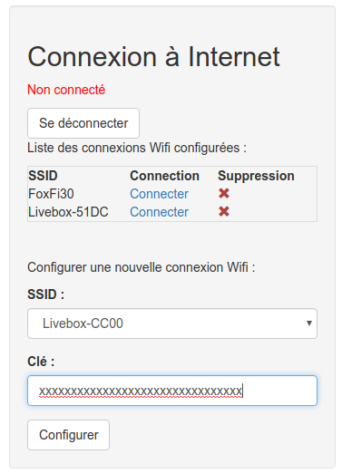
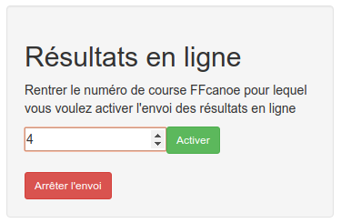

### Résultats en ligne
Avec Racebox, la publication automatique de résultats en ligne est très simple. Il suffit de disposer d'une connexion internet par Wifi (box internet classique, ou smartphone configuré en partage de connexion).

* Tout d'abord, il faut connecter Racebox à Internet. Pour celà, accéder à l'interface (http://racebox.lan)

* Si la connexion est déjà enregistrée, il suffit de cliquer sur "Connecter".
* Pour se connecter à un nouveau réseau, sélectionner le réseau dans le menu déroulant "SSID", rentrer la clé, puis cliquer sur "Configurer".
* Après quelques instants, le nouveau réseau devrait apparaître dans la liste des connexions configurées. Cliquer sur "Connecter".

* Une fois connecté à internet, il faut activer l'envoi des résultats au serveur distant. Pour celà, il faut repérer dans FFCanoe, dans la liste des courses, la valeur de la colonne "id" correspondant à la course dont on veut publier les résultats.
* Reporter cette valeur dans la case dédiée sur l'interface Racebox, puis cliquer sur "Activer".
* Les résultats devraient être maintenant visibles sur [http://resultats.racebox-ck.com/](http://resultats.racebox-ck.com/)

Attention, lors du changement de phase (passage de la qualif à la finale par exemple), on change de course, il faut donc changer l'id de la course dans l'interface Racebox pour activer les résultats en ligne pour la phase 2 !
